# GCD Class Documentation

## Overview
The `GCD` class is designed for handling and analyzing Galvanostatic Charge-Discharge (GCD) data. It inherits from `ECLab_File` and expects the input data file to contain **time**, **current**, and **voltage** data. If any of these are missing, an error will be raised.

This class provides methods and properties to detect and analyze important regions and cycles within the GCD data, such as current regions, charging/discharging phases, voltage hold regions, and charge-discharge cycles.

---

## Properties

### mass1
- **Type**: float
- **Description**: Mass of the first electrode in mg.

### mass2
- **Type**: float
- **Description**: Mass of the second electrode in mg.

### detected_current_regions
- **Type**: List[tuple]
- **Description**: Returns the detected current regions in the form of a list of tuples where each tuple is formatted as (positive/negative/zero, start_index, end_index).

### detected_charging_regions
- **Type**: List[tuple]
- **Description**: Returns the detected charging regions in the form of a list of tuples where each tuple has format: (current_region, charging_profile, start_index, end_index).

### detected_charge_discharge_cycles
- **Type**: List[tuple]
- **Description**: Returns the detected charge-discharge cycles in the form of a list of tuples where each tuple has format: (charging_region, discharging_region).

## Initialisation

### __init__(self, filepath: Optional[str] = None, mass1: float = 0.0, mass2: float = 0.0)
- **Description**: Initializes the GCD object with the given file path and electrode masses in mg.

## Region Detection Methods

### detect_current_regions(self, zero_threshold: float = 0.1, min_region_length: int = 5)
This method detects regions of the GCD data where the current is either
        positive, negative, or zero. Zero current is defined as being between 
        -zero_threshold and zero_threshold. A region must also contain at least
        min_region_length data points to be considered a valid region. Detected
        regions are accessed via the `detected_regions` property. They are
        stored as a list of tuples in the format: 
        (region_type, start_index, end_index) where region_type is one of
        'POSITVE_CURRENT', 'NEGATIVE_CURRENT', or 'ZERO_CURRENT'.
        The start_index and end_index are the indices of the first and last data
        points in the region, respectively.
        If end_index corresponds to last data point, then it is saved as -1.
    
        :param zero_threshold: Threshold for defining zero current region
        :param min_region_length: Minimum length of a region to be considered
            valid

#### Example
First look at a GCD which uses short zero-current holds:
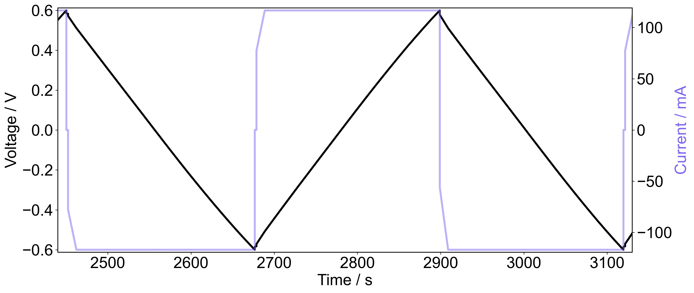
Now try detecting the different current regions using `detect_current_regions(zero_threshold=0.1, min_region_length=10)` and plot the different regions using red to indicate regions of positive current, blue for negative current and green for zero-current.
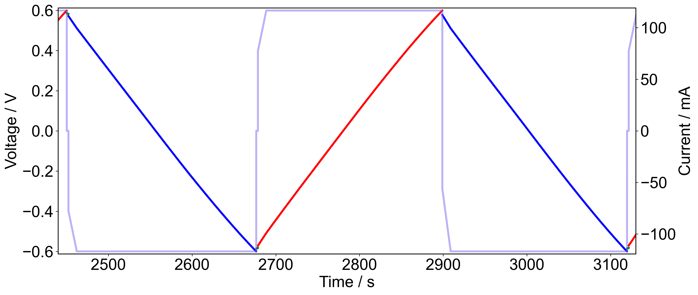
Hopefully it is clear in the above figure that the regions have been correctly identified. Depending on how accurately your potentiostat can achieve zero-current will determine the threshold you wish to set. In reality you only want to be able to find zero-current regions if you are explicitly including zero-current holds in your charging profiles, otherwise the recommendation is to set the threshold very low so that regions of low current due to voltage holds are not misidentified.

Code to generate above plot:
```python
from ECAnalyse.SuperCap.GCD import GCD
from ECAnalyse.custom_plt import plt, fig_h, fig_w
gcd = GCD(\path\to\file)
def current_regions():
    fig, ax = plt.subplots()
    ax2 = ax.twinx()
    gcd.plot(ax=ax, alpha=0)
    fig.set_size_inches(fig_w*2, fig_h)
    gcd.detect_current_regions(zero_threshold=0.1, min_region_length=10)
    for region in gcd.detected_current_regions:
        start, end = region.start, region.end
        colors = {
            'POSITIVE_CURRENT': 'red',
            'NEGATIVE_CURRENT': 'blue',
            'ZERO_CURRENT': 'green'
        }
        color = colors[region.parity]
        ax.plot(gcd.t[start:end], gcd.E[start:end], color=color)
    gcd.plot_current(ax=ax2, color='mediumslateblue', alpha=0.5)
    ax.set_xlim(2440, 3130)
    plt.show()
```

### detect_voltage_hold_regions(self, min_region_length: int = 25, zero_threshold: float = 0.001)
This method detects regions where the voltage is held constant.
        This is quite a common addition to GCD experiments and it is
        important to detect these in order to identify cycles correctly.

        :param min_region_length: Minimum length of a region to be considered
            valid. If a region is shorter than this, it will not be included in
            the detected regions.
        :param zero_threshold: Threshold for defining a region as a voltage hold.
            If the voltage change is less than this threshold, then it is
            considered a voltage hold region.

#### Example
Below is a GCD which utilises voltage holds. Using `detect_voltage_holds(min_region_length=5, zero_threshold=0.001)` the holds are identified and shown in red in the figure below.
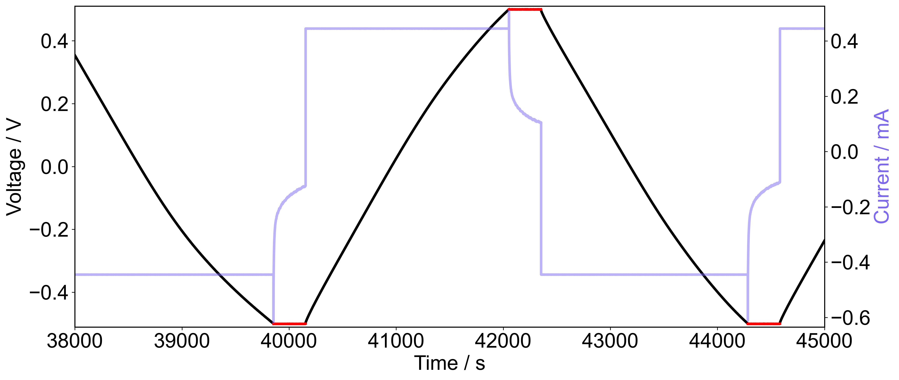
Code to generate above plot:
```python
gcd = GCD('path/to/file')
fig, ax = plt.subplots()
fig.set_size_inches(fig_w*2, fig_h)
ax2 = ax.twinx()
gcd.plot(ax=ax)
gcd.plot_current(ax=ax2, color='mediumslateblue', alpha=0.5)
ax2.yaxis.label.set_color('mediumslateblue')
ax.set_xlim(38000, 45000)

gcd.detect_voltage_hold_regions(min_region_length=5, zero_threshold=0.001)
for region in gcd.detected_voltage_hold_regions:
    start, end = region.start, region.end
    ax.plot(gcd.t[start:end], gcd.E[start:end], color='red')

plt.show()
```

### detect_charging_regions(self, min_region_length: int = 5, zero_threshold: float = 0.002)
This method looks at the detected current regions and voltage profile
        to determine where the capacitor can be considered to be charging or
        discharging.
        Charging is defined as when the voltage is moving away from zero.
        In this case if current is positive, then if voltage is positive then 
        it is considered charging.

        :param min_region_length: Minimum length of a region to be considered
            valid. If a region is shorter than this, it will not be included in
            the detected regions.
        :param zero_threshold: Threshold for defining a region as a switch. If
            the voltage is between -zero_threshold and zero_threshold, then
            it is treated as zero in terms of defining the parity.

#### Example
We can now look at how charging regions are calculated for a GCD which involves voltage holds and a switching profile. First we can use ECAnalyse to detect the current regions (red if positive, blue if negative) and the voltage hold regions (orange). We can then detect the regions we designate as charging (purple) or discharging (pink).
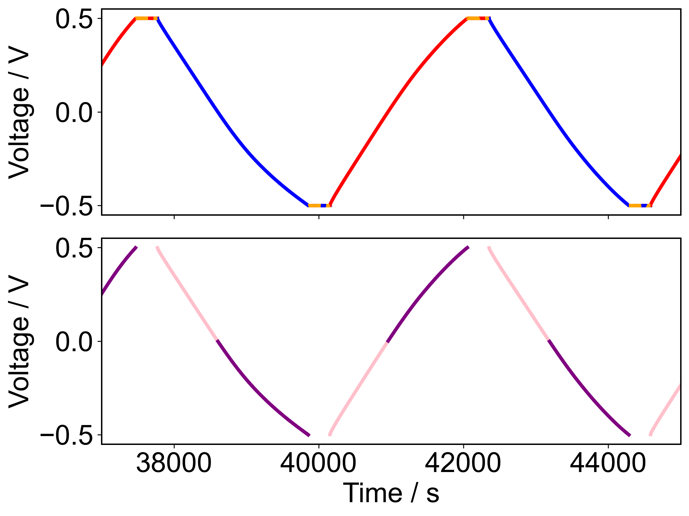
Note that in the way we have detected the current regions, they overlap with the voltage holds. However the charging regions explicitly do NOT include the voltage holds. Also note that charging is defined as moving away from zero voltage, hence the splitting of the seemingly single cycle into two separate cycles.

The code to generate the above figure is given here:
```python
fig, axs = plt.subplots(2, 1, sharex=True)
gcd = GCD('/path/to/file')
gcd.detect_current_regions(zero_threshold=0.01)
gcd.detect_voltage_hold_regions(zero_threshold=0.001)
current_colors = {
    'POSITIVE_CURRENT': 'red',
    'NEGATIVE_CURRENT': 'blue',
    'ZERO_CURRENT': 'green',
}
for region in gcd.detected_current_regions:
    color = current_colors[region.parity]
    start, end = region.start, region.end
    axs[0].plot(gcd.t[start:end], gcd.E[start:end], color=color)

for region in gcd.detected_voltage_hold_regions:
    start, end = region.start, region.end
    axs[0].plot(gcd.t[start:end], gcd.E[start:end], color='orange', linestyle='--')

charging_colors = {
    'CHARGING': 'purple',
    'DISCHARGING': 'pink',
    'ZERO_VOLTAGE': 'green',
    'ZERO_CURRENT': 'orange'
}
gcd.detect_charging_regions(zero_threshold=0.001)
for region in gcd.detected_charging_regions:
    start, end = region.start, region.end
    color = charging_colors[region.parity]
    axs[1].plot(gcd.t[start:end], gcd.E[start:end], color=color)

axs[0].set_xlim(37000, 45000)
axs[0].set_ylim(-0.55, 0.55)
axs[1].set_ylim(-0.55, 0.55)
axs[0].set_ylabel('Voltage / V')
axs[1].set_ylabel('Voltage / V')
axs[1].set_xlabel('Time / s')
plt.show()
```

### detect_charge_discharge_cycles(self)
This method detects entire charge-discharge cycles. Each cycle must start with a charging region and contain exactly one charging and one discharging region.

#### Example
Using again some sample GCD data involving voltage holds, we can see what ECAnalyse decides is a single charge-discharge cycle.
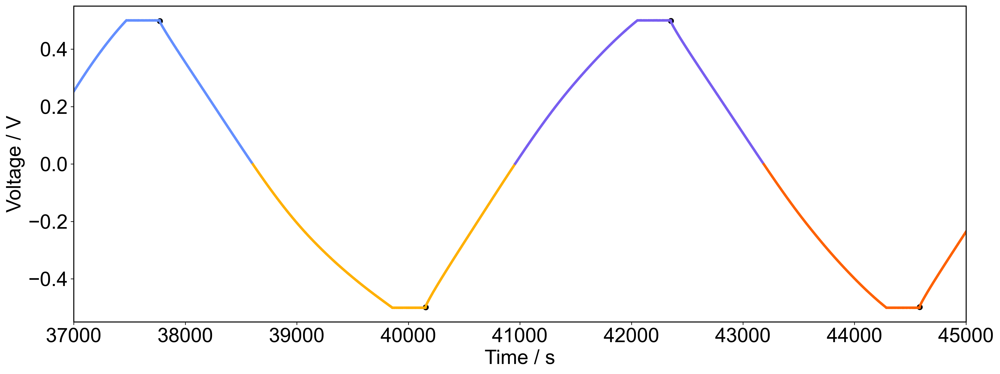

We see that `ECAnalyse` has correctly identified the charge-discharge cycles, and in each cycle a black dot has been added where `ECAnalyse` believes the discharge part of the cycle begins.

Code to produce above figure:
```python
fig, ax = plt.subplots()
fig.set_size_inches(fig_w*2, fig_h)
gcd = GCD('/path/to/file')
gcd.detect_current_regions(zero_threshold=0.01)
gcd.detect_voltage_hold_regions(zero_threshold=0.001)
gcd.detect_charging_regions(zero_threshold=0.001)
gcd.detect_charge_discharge_cycles()
for cycle in gcd.detected_charge_discharge_cycles:
    start, end = cycle.start, cycle.end
    discharge_start = cycle.discharging.start
    ax.plot(gcd.t[start:end], gcd.E[start:end])
    ax.scatter([gcd.t[discharge_start]], [gcd.E[discharge_start]], color='black')
ax.set_xlabel('Time / s')
ax.set_ylabel('Voltage / V')
ax.set_ylim(-0.55, 0.55)
plt.show()
```

### charge_discharge_cycle_times(self)
Calculates the charge-discharge cycle times using the detected 
        charge-discharge cycles. The cycle time is defined as the time between
        the start of the charging region and the end of the discharging region.

        :return: Numpy array of cycle times for each cycle

## Analysis Methods
### Coulomb_efficiencies(self) -> np.ndarray
Calculates the charge-discharge cycle Coulomb efficiencies using the 
        detected charge-discharge cycles. The Coulomb efficiency is defined as
        discharged charge / charging charge, as a percentage.

        :return: Numpy array of Coulomb efficiencies for each cycle

#### Theory
For an ideal supercapacitor, the amount of charge passed during charging, should all be accessible again during the discharge step. The Coulomb efficiency is a measure of how much charge is returned after being used for charging.

The charge passed over a given amount of time, $Q$, is determined from the current using
```math
Q = \int_\text{start}^\text{end}I dt
```

When the `Coulomb_efficiencies` method of the GCD class is called, it first calculates the cumulative charge $Q(t)$ if it has not already been calculated using 
```math
Q(t) = \int_0^{T=t}I dT
```

and then calculates from this the absolute value of the charge passed during the charge step of a charge-discharge cycle (all of the cycle before the start of the discharging section) and the charge passed during the discharge section (all of the remaining charge-discharge cycle).

Coulombic efficiency is then calculates as
```math
\text{Efficiency}_\text{Coulomb} = \frac{Q_\text{Discharge}}{Q_\text{Charge}}
```

#### Example
Using the same sample GCD data as before, we can plot the cumulative charge against time (red when capacitor charging and blue when discharging) and then also plot the Coulomb efficiencies against time.
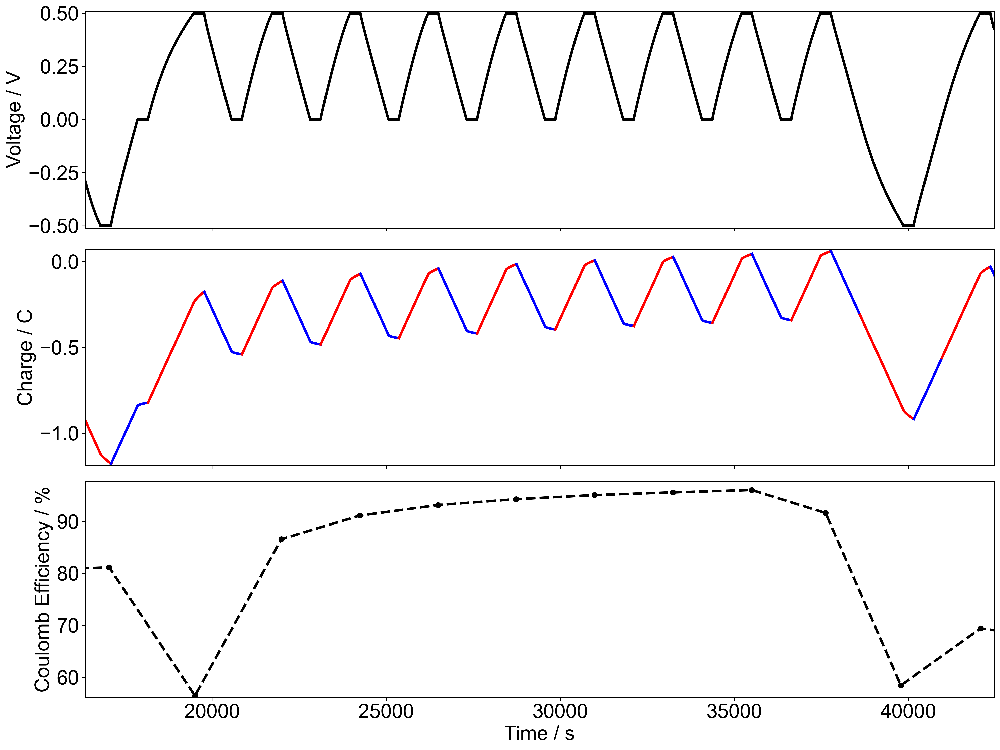

Code for generating figure:
```python
fig, axs = plt.subplots(3, 1, sharex=True)
fig.set_size_inches(fig_w*2, fig_h*2)
gcd = GCD('/path/to/file')
gcd.detect_current_regions(zero_threshold=0.01)
gcd.detect_voltage_hold_regions(zero_threshold=0.001)
gcd.detect_charging_regions(zero_threshold=0.001)
gcd.detect_charge_discharge_cycles()
gcd.calculate_cumulative_charge()
Coulom_effs = gcd.Coulomb_efficiencies()
cycle_times = gcd.charge_discharge_cycle_times()

gcd.plot(ax=axs[0])
for cycle in gcd.detected_charge_discharge_cycles:
    start, mid, end = cycle.start, cycle.discharging.start, cycle.end
    axs[1].plot(gcd.t[start:mid], gcd.Q[start:mid], color='red')
    axs[1].plot(gcd.t[mid:end], gcd.Q[mid:end], color='blue')

axs[2].plot(cycle_times, Coulom_effs, marker='o', linestyle='--', color='black')

axs[0].set_xlabel('')
axs[2].set_xlabel('Time / s')
axs[1].set_ylabel('Charge / C')
axs[2].set_ylabel('Coulomb Efficiency / %')
plt.show()
```

### energy_efficiencies(self) -> np.ndarray
Calculates the charge-discharge cycle energy efficiencies using the 
        detected charge-discharge cycles. The energy efficiency is defined as
        discharged energy / charging energy, as a percentage.

        :return: Numpy array of energy efficiencies for each cycle

#### Theory
This is similar to the Coulomb efficiency except instead of keeping track of amount of charge passed during charge and discharge, the energy is accounted for instead. Cumulative energy consumed by the capacitor, $E(t)$, is calculated via the following method:
```math
E(t) = \int_0^{T = t} P dT = \int_0^{T = t} IV dT
```

This can be automatically calculated using the `calculate_cumulative_energy` method of ECLab_File objects (GCD is a child class of ECLab_File). 

Similar to the calculation of Coulomb efficiencies, the efficiency is defined as
```math
\text{Efficiency}_\text{Energy} = \frac{E_\text{Discharge}}{E_\text{Charge}}
```

#### Example
Repeat essentially the example given for Coulomb efficiencies.
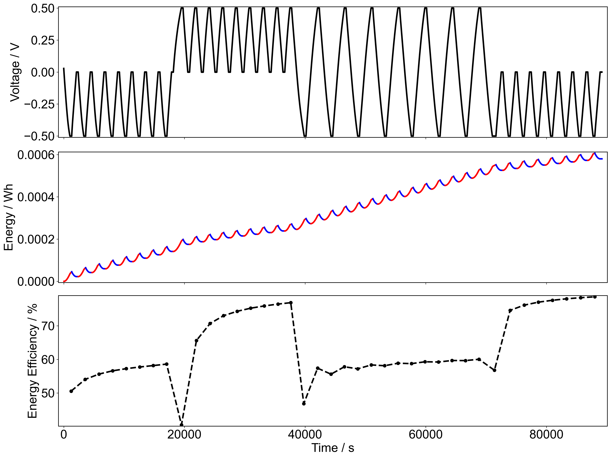

Code to generate figure:
```python
fig, axs = plt.subplots(3, 1, sharex=True)
fig.set_size_inches(fig_w*2, fig_h*2)
gcd = GCD('path/to/file')
gcd.detect_current_regions(zero_threshold=0.01)
gcd.detect_voltage_hold_regions(zero_threshold=0.001)
gcd.detect_charging_regions(zero_threshold=0.001)
gcd.detect_charge_discharge_cycles()
gcd.calculate_cumulative_energy()
energy_effs = gcd.energy_efficiencies()
cycle_times = gcd.charge_discharge_cycle_times()

gcd.plot(ax=axs[0])
for cycle in gcd.detected_charge_discharge_cycles:
    start, mid, end = cycle.start, cycle.discharging.start, cycle.end
    axs[1].plot(gcd.t[start:mid], gcd.energy[start:mid], color='red')
    axs[1].plot(gcd.t[mid:end], gcd.energy[mid:end], color='blue')

axs[2].plot(cycle_times, energy_effs, marker='o', linestyle='--', color='black')

axs[0].set_xlabel('')
axs[2].set_xlabel('Time / s')
axs[1].set_ylabel('Energy / Wh')
axs[2].set_ylabel('Energy Efficiency / %')
plt.show()
```


### resistances(self) -> np.ndarray
Calculates the resistance for each charge-discharge cycle using the 
        ohmic drop method. R = ΔV / ΔI, where ΔV is the voltage drop and 
        ΔI is the change in current. Voltage drop calculated as difference
        last voltage in charge region and first voltage in discharge region.
        ΔI is the change in current between the same two points.

        :return: Numpy array of resistances for each cycle in Ohms

#### Theory
The supercapacitor is modelled as an ideal capacitor is series with a resistor. In the GCD experiment a constant current, $I$ is applied through both the capacitor and the resistor. This current results in a voltage across the resistor, $V = IR$. As current continues to flow, a voltage also builds up across the capacitor. The measured Voltage, $V$ is equal to the sum of the Voltages from the capacitor $V_C$ and the resistor $V_R$
```math
V(t) = V_C(t) + V_R = \frac{Q_0+It}{C} + IR
```
No wimagine a GCD experiment where the capacitor starts completely uncharged ($Q_0=0$) and a constant current of $I_1$ is applied until a Voltage of $V_\text{charged}$ is reached, which we will say happens at time $t_\text{charged}$. We will also assume that the capacitance is constant. Then we can write
```math
V_\text{charged} = \frac{I_1 t_\text{charged}}{C} + I_1R
```
After reaching the desired voltage, the current is changed such that a constant current of $-I_2$ is now applied. We can write out what the measured voltage will be:
```math
V(\Delta t) = \frac{I_1 t_\text{charged} - I_2 \Delta t}{C} - I_2 R
```
Now we can consider the drop in measured voltage $\Delta V = V(\Delta t) - V_\text{charged}$. And consider the limit of this values as $\Delta t \rightarrow 0$
```math
\lim_{\Delta t \rightarrow 0} \Delta V = -R(I_1 + I_2)
```
Therefore by measuring the change in voltage immediately after changing the applied current, the in-series resistance may be measured. A common misconception in measuring the resistance from an Ohmic drop is to only consider the current applied beforehand instead of the change in applied current.

#### Example
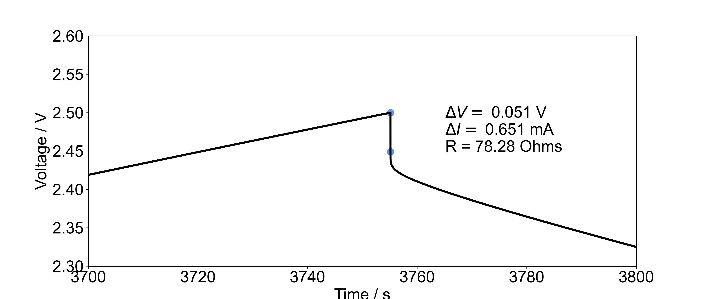
The above figure shows for a sample GCD which points are considered when calculating the resistance. When using the `resistances` method, it iterates through the detected charge-discharge cycles. Identifues which point is the start of the discharge portion and using the point immediately before as the initial voltage and current. 

Code for plot:
```python
gcd = GCD('/path/to/file')
fig, ax = plt.subplots()
fig.set_size_inches(fig_w*2, fig_h)
gcd.detect_current_regions(zero_threshold=0.01)
gcd.detect_voltage_hold_regions(zero_threshold=0.001)
gcd.detect_charging_regions(zero_threshold=0.001)
gcd.detect_charge_discharge_cycles()

gcd.plot(ax=ax)
ax.set_xlim(3700, 3800)
ax.set_ylim(2.3, 2.6)

for cycle in gcd.detected_charge_discharge_cycles:
    dstart = cycle.discharging.start
    cend   = cycle.discharging.start - 1
    t1, t2, V1, V2 = gcd.t[cend], gcd.t[dstart], gcd.E[cend], gcd.E[dstart]
    I1, I2 = gcd.I[cend], gcd.I[dstart]
    ax.scatter(
        [t1, t2],
        [V1, V2], color='cornflowerblue', s=100)
    ax.text(
        t1+10, V2,
        f"$\Delta V = $ {V1 - V2:.3f} V\n$\Delta I = $ {I1 - I2:.3f} mA\nR = {(V1-V2)*1000/(I1-I2):.2f} Ohms")
plt.show()
```


### instantaneous_capacitances(self, window: int = 10) -> List[np.ndarray]
Calaculates the instantaneous capacitance for each point in the 
        discharging sections of the GCD experiment.
        Q = CV, take the time derivative and assume that the capacitance is not
        a function of time, then dQ/dV = CdV/dt. 
        dQ/dV is of course the current, such that C = I / dV/dt.
        The derivative is calculated using linear regression over a sliding
        window of size window. The current is taken as the average current over
        the same window.
        Capacitance here is calculated in Farads
        
        :param window: The window size over which linear regression is applied.
        :return: List of numpy arrays, each corresponding to the instantaneous 
            capacitance for each discharging section of the GCD experiment.

#### Theory
Start with the general equation reltaing capacitance to stored charge and voltage.
```math
Q = CV
```
Now take the derivative of the above equation with respect to time assuming that the capacitance is constant.
```math
\frac{dQ}{dt} = C\frac{dV}{dt}
```
Now note that the time derivative of the stored charge is simply the current so that the following relationship is obtained to describe the capacitance in terms of applied current and rate of change of voltage.
```math
C = I \div \frac{dV}{dt}
```
Therefore by finding the gradient of the Voltage-time profile, and by knowing the current at all times, the capacitance at every point in the discharge section can be calculated.

#### Example
Here we take some example GCD data and try calculating the instantaneous capacitances using `window=50` but note that the default is `10`.
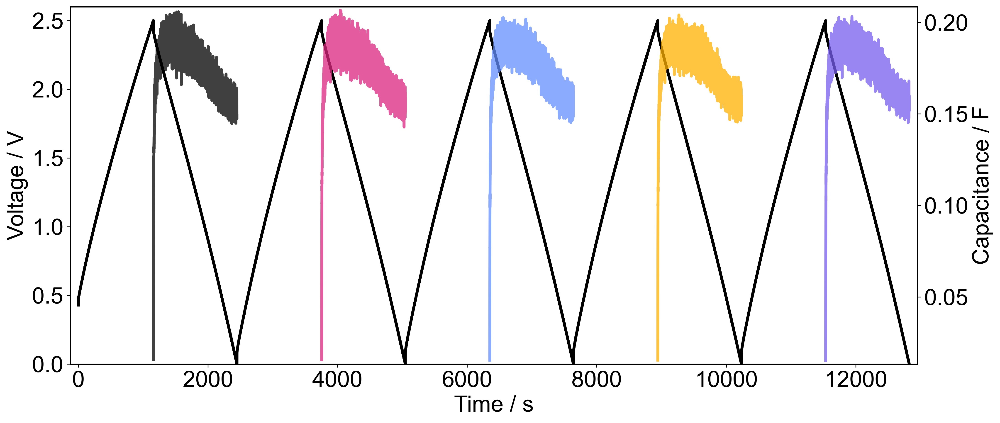.
Note that for all of the cycles the data is quite noisy, despite the relatively large window for calculating over. Also note that over the discharge cycle, the capacitance does change and this is reproducible across the cycles so is in fact a real attribute of the cell. This figure also illustrates the importance of describing which region is considered when reporting a single capacitance value for carbon supercapacitor electrodes. For example in all cycles the capacitance appears to decrease as the cell discharges, therefore the more of the first part of the discharge is considered, the higher a single reported value of capacitance will be.

Code for making the above figure:
```python
gcd = GCD('/path/to/file')
fig, ax = plt.subplots()
fig.set_size_inches(fig_w*2, fig_h)

gcd.detect_current_regions(zero_threshold=0.01)
gcd.detect_voltage_hold_regions(zero_threshold=0.001)
gcd.detect_charging_regions(zero_threshold=0.001)
gcd.detect_charge_discharge_cycles()

gcd.plot(ax=ax)
ax.set_ylim(0, 2.6)

ax2 = ax.twinx()
w = 50
capacitances = gcd.instantaneous_capacitances(window=w)

for cycle, Cs in zip(gcd.detected_charge_discharge_cycles, capacitances):
    discharging = cycle.discharging
    start, end = discharging.start, discharging.end
    if end == -1: end = None

    # Calculate the times the capacitances correspond to and then plot
    ts = np.convolve(gcd.t[start:end], np.ones(w)/w, mode='valid')
    ax2.plot(ts, Cs, alpha=0.75)

ax2.set_ylabel('Capacitance / F')
plt.show()
```

### gravimetric_instantaneous_capacitances(self, window: int = 10) -> List[np.ndarray]
This method calculates the gravimetric instantaneous capacitance for 
        each discharging section of the GCD experiment.
        The convention used here is that the supercap consists of two double-
        layer capacitors in series. The two in-series capacitors are assumed to 
        be equal, such that the total capacitance is given by: 
        C_total = C_single / 2. The gravimetrric capacitance is then obtained 
        by dividing the single-electrode capacitance by half the total mass.

        :param window: The window size over which linear regression is applied 
            to calculate the instantaneous capacitance.
        :return: List of numpy arrays, each corresponding to the gravimetric 
            instantaneous capacitance for each discharging section of the GCD
            experiment. 

#### Theory
When calculating the gravimetric capacitance the view is taken that the supercapacitor consists of two double-layer capacitors in series with eachother. Therefore if we suppose that the capacitance of the two double-layer capacitors are $C_1$ and $C_2$ then the total capacitance of the cell, $C_T$ is given by
```math
\frac{1}{C_T} = \frac{1}{C_1} + \frac{1}{C_2}
```
The next assumption that is made is that the two double-layer capacitances are equal and we can therefore refer to a double-layer capacitance such that 
```math
C_T = \frac{C_{DL}}{2}
```
We then make a further assumption that the two electrode masses are roughly equal and that we can use the average value as the mass of an electrode
```math
m = \frac{m_1 + m_2}{2}
```
Finally, the gravimetric capacitance is calculated as the double-layer capacitance divided by the average electrode mass
```math
C_\text{grav} = \frac{C_\text{DL}}{m} = 4 \times\frac{C_T}{m_1 + m_2}
```
Therefore this method uses `instantaneous_capacitances` to calculate the total cell capacitance at each timepoint of the discharge section, then divides by the total electrode mass and multiplies by four to return the instantaneous gravimetric capacitances.

#### Example
Using the same example as for `instantaneous_capacitances` but calculating the gravimetric version.
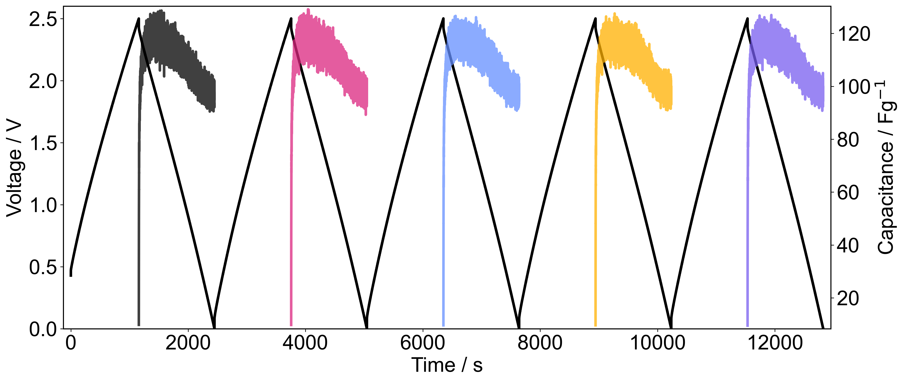
Code for figure:
```python
gcd = GCD('/path/to/file', mass1=3.3, mass2=3.1)
fig, ax = plt.subplots()
fig.set_size_inches(fig_w*2, fig_h)

gcd.detect_current_regions(zero_threshold=0.01)
gcd.detect_voltage_hold_regions(zero_threshold=0.001)
gcd.detect_charging_regions(zero_threshold=0.001)
gcd.detect_charge_discharge_cycles()

gcd.plot(ax=ax)
ax.set_ylim(0, 2.6)

ax2 = ax.twinx()
w = 50
capacitances = gcd.gravimetric_instantaneous_capacitances(window=w)

for cycle, Cs in zip(gcd.detected_charge_discharge_cycles, capacitances):
    discharging = cycle.discharging
    start, end = discharging.start, discharging.end
    if end == -1: end = None

    # Calculate the times the capacitances correspond to and then plot
    ts = np.convolve(gcd.t[start:end], np.ones(w)/w, mode='valid')
    ax2.plot(ts, Cs, alpha=0.75)

ax2.set_ylabel('Capacitance / Fg$^{-1}$')
plt.show()
```

### cycle_capacitances_instantaneous_average(self, window: int = 10, over_last: float = 0.25) -> np.ndarray
This method calculates the capacitance for each charge-discharge cycle
        by taking the average of the instantaneous capacitance over the last
        `over_last` portion of the discharge step.

        :param window: The window size over which linear regression is applied 
            to calculate the instantaneous capacitance.
        :param over_last: The portion of the discharge step to average over,
            expressed as a fraction of the total discharge step length.
            For example, 0.25 means the last 25% of the discharge step.
        :return: Numpy array of average capacitances for each charge-discharge
            cycle, calculated as the average of the instantaneous capacitance
            over the last over_last portion of the discharge step.

#### Theory
This method uses the instantaneous values calculated using `instantaneous_capacitances` and then takes an average of those values from a chosen start to the end of the discharge region. As shown in previous examples, assuming that the capacitance does not change over the voltage window is not always accurate to reality and therefore it should always be reported over which region you are averaging.

#### Example
Here we take the same sample data as used in the previous examples and find the cycle capacitances, calculated over various amount of the discharge section.
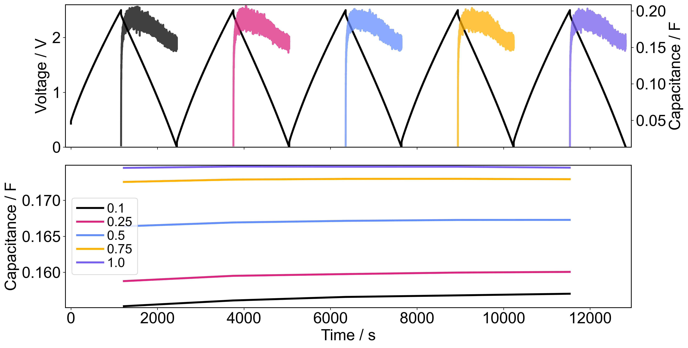
As expected from how the instantaneous capacitances look, the more of the discharge section we use, the higher the average capacitance. Again this is a key example of why it is important to consider which section it makes most sense to average over when reporting these values.

Code for the figure:
```python
gcd = GCD('/path/to/file')
fig, axs = plt.subplots(2, sharex=True)
ax, ax3 = axs
ax2 = ax.twinx()
fig.set_size_inches(fig_w*2, 1.2*fig_h)

gcd.detect_current_regions(zero_threshold=0.01)
gcd.detect_voltage_hold_regions(zero_threshold=0.001)
gcd.detect_charging_regions(zero_threshold=0.001)
gcd.detect_charge_discharge_cycles()

gcd.plot(ax=ax)
ax.set_ylim(0, 2.6)

w = 50
capacitances = gcd.instantaneous_capacitances(window=w)

for cycle, Cs in zip(gcd.detected_charge_discharge_cycles, capacitances):
    discharging = cycle.discharging
    start, end = discharging.start, discharging.end
    if end == -1: end = None

    # Calculate the times the capacitances correspond to and then plot
    ts = np.convolve(gcd.t[start:end], np.ones(w)/w, mode='valid')
    ax2.plot(ts, Cs, alpha=0.75)

ax2.set_ylabel('Capacitance / F')

cycle_times = gcd.charge_discharge_cycle_times()
for over_last in [0.1, 0.25, 0.5, 0.75, 1.0]:
    capacitances = gcd.cycle_capacitances_instantaneous_average(
        window = w, over_last = over_last
    )
    ax3.plot(cycle_times, capacitances, label=f'{over_last}')

ax.set_xlabel('')
ax3.set_xlabel('Time / s')
ax3.set_ylabel('Capacitance / F')
ax3.legend()
plt.show()
```

### cycle_capacitances_linear_regression(self, over_last: float = 0.25) -> np.ndarray
This method calculates the capacitance for each charge-discharge cycle
        by performing linear regression on the voltage profile over the last
        over_last portion of the discharge step. The capacitance is calculated
        as the slope of the linear fit to the voltage profile. Also calculated
        are the errors in the capacitance and the R^2 values.

        :param over_last: The portion of the discharge step to average over,
            expressed as a fraction of the total discharge step length.
            For example, 0.25 means the last 25% of the discharge step.
        :return: MetaArray with the main array corresponding to the capacitance 
            of each deteched charge-discharge cycle in Farads. In the metadata 
            there is attribute `errors` containing the calculated error in each
            of the calculated capacitances and there is also `R2s` which are the
            R^2 values of the linear fit for determining the slope.

#### Theory
The method of converting current and rate of change in Voltage to a value of capacitance is covered already in the documentation for the `instantaneous _capacitances` method above. Here we will describe the theory behind how the errors are calculated.

First start with the relationship between capacitance, current and change in voltage:
```math
C = I \div \frac{dV}{dt} = \frac{I}{y}
```
where we replace the rate of change of Voltage with the variable $y$. Now perform partial
differentiation with respect $I$ and $y$.
```math
\partial C = \frac{1}{y}\partial I - \frac{I}{y^2}\partial y
```
From this equation and assuming that errors in $I$ and $y$ follow Gaussian distributions, then from the above partial differential, the standard error for $C$, $\Delta C$, is calculated according to the following equation.
```math
\Delta C = \sqrt{\left( \frac{\Delta I}{y} \right)^2 + \left( \frac{I \Delta y}{y^2}\right)^2}
```
In this function, the values of $\Delta I$ and $\Delta y$ are calculated as the standard deviation of these values over the data considered. The values of $I$ and $y$ are taken as the mean values over the same data.

### cycle_capacitances(self, linear_regression: bool = False, window: int = 10, over_last: float = 0.25) -> np.ndarray
This method calculates the capacitance for each charge-discharge cycle.
        It can either use the instantaneous capacitance method or the linear
        regression method to calculate the capacitance.

        :param linear_regression: If True, use linear regression to calculate
            capacitance. If False, use average over instantaneous capacitance.
        :param window: The window size for calculating instantaneous capacitance
        :param over_last: The portion of the discharge step to average over,
            expressed as a fraction of the total discharge step length.
            For example, 0.25 means the last 25% of the discharge step.
        :return: Numpy array of capacitances for each charge-discharge cycle.

### gravimetric_cycle_capacitances(self, linear_regression: bool = False, window: int = 10, over_last: float = 0.25) -> np.ndarray
This method calculates the gravimetric capacitance for each 
        charge-discharge cycle. It can either use the instantaneous capacitance
        method or the linear regression method to calculate the capacitance.

        :param linear_regression: If True, use linear regression to calculate
            capacitance. If False, use average over instantaneous capacitance.
        :param window: The window size for calculating instantaneous capacitance
        :param over_last: The portion of the discharge step to average over,
            expressed as a fraction of the total discharge step length.
            For example, 0.25 means the last 25% of the discharge step.
        :return: Numpy array of gravimetric capacitances for each 
            charge-discharge cycle.

## Plotting Methods

### plot(self,ax: Optional[Axes] = None, title: str = '', rolling_average: bool = False, window_size: int = 10, **kwargs) -> Axes
Plots the GCD experiment data as Voltage vs Time

        :param ax: matplotlib Axes object to plot on. If None then uses current
            active Axes.
        :param title: Title for the plot
        :param rolling_average: If True, applies a rolling average to the data
        :param window_size: Size of the rolling average window if using
        :param kwargs: Additional keyword arguments to pass to the plot

### plot_current(self, ax: Optional[Axes] = None, labels: Optional[List[str]] = None, title: str = '', rolling_average: bool = False, window_size: int = 10, **kwargs) -> Axes
Plots the GCD experiment data as Current vs Time

        :param ax: matplotlib Axes object to plot on. If None then uses current
            active Axes.
        :param title: Title for the plot
        :param rolling_average: If True, applies a rolling average to the data
        :param window_size: Size of the rolling average window if using
        :param kwargs: Additional keyword arguments to pass to the plot

### plot_charging_regions(self, ax: Optional[Axes] = None, **kwargs ) -> Axes
Plots the voltage profile against time, however colours the regions it
        has detected as either charging, discharging or zero in different 
        colours.

        :param ax: matplotlib Axes object to plot on. If None then uses current
            active Axes.
        :param kwargs: Additional keyword arguments to pass to the plot

### plot_charge_discharge_cycles(self, ax: Optional[Axes] = None, **kwargs) -> Axes
Plots the charge-discharge cycles detected in the GCD experiment.

        :param ax: matplotlib Axes object to plot on. If None then uses current
            active Axes.
        :param kwargs: Additional keyword arguments to pass to the plot

### full_analysis(self)
This method performs all of the necessary analysis on the GCD experiment
        and saves the results as pdf files in the specified directory. It also
        saves the calculated results in a text file in the same directory.